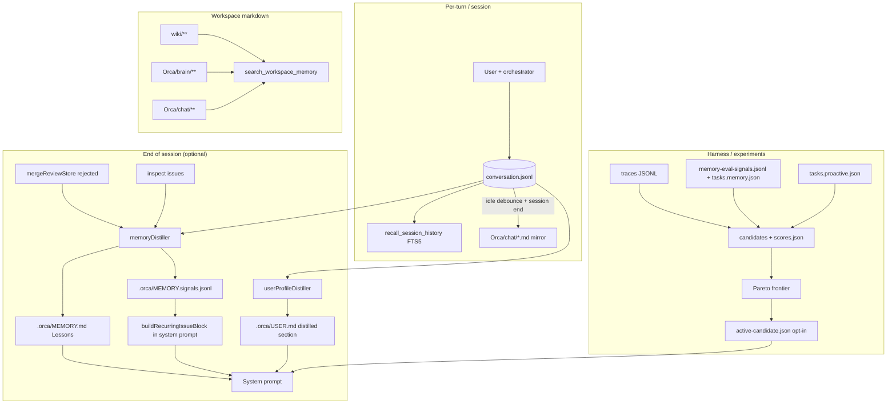

# Orca memory architecture

Single-page map of how orchestrator memory, vault mirrors, harness traces, and the session distiller fit together.

## Principles

| Rule | Meaning |
|------|--------|
| **JSONL is canonical** | `~/.orca/sessions/<id>/conversation.jsonl` is the source of truth for chat. |
| **Markdown is derived** | `Orca/chat/*.md`, `Orca/brain/*.md`, and wiki pages are **mirrors** for Obsidian (not authoritative). |
| **One tool for knowledge** | Prefer **`search_workspace_memory`** for vault markdown; **`search_project_wiki`** is a deprecated alias. |
| **One sink per concern** | e.g. distiller signals → `.orca/MEMORY.signals.jsonl`; lessons → `.orca/MEMORY.md`; **user model** → `.orca/USER.md` / `~/.orca/USER.md` (see [`PROACTIVE_ORCA_HARNESS.md`](PROACTIVE_ORCA_HARNESS.md)). |
| **Surface errors** | Vault mirror failures go through **`vaultMirrorDiagnosticsStore`** (Settings visibility), not silent catches. |

## C1 / C2 defaults (distiller + recurring-issue block)

**Session-end distiller (C1)** and **recurring-issue injection from signals (C2)** are **off by default** in Settings (`orcaMemoryDistillerEnabled: false`). Real orchestrator improvement from these features depends on your model, task mix, and whether repeated failures actually appear in `.orca/MEMORY.signals.jsonl`.

**Recommended:** run the **memory harness eval** (below). If `memoryEval.passRateDelta` is **not** positive (warm should beat cold), keep C1/C2 disabled or treat them as experimental.

## Memory harness eval (`tasks.memory.json`)

Deterministic **cold → warm** check (no live LLM):

1. **Cold:** empty `.agent-canvas/harness/memory-eval-signals.jsonl` → three `memory_recurring_gate` tasks **fail** (no duplicate distiller-shaped rows yet — analogous to “first session” without recurring context).
2. **Warm:** the CLI **seeds** six JSONL lines (pairs per failure mode: error / stagnation / inspect) matching the same key logic as `buildRecurringIssueBlock` / distiller signals.
3. **Scores:** `scores.json` includes **`memoryEval`**: `coldPassRate`, `warmPassRate`, **`passRateDelta`** (warm − cold), plus per-task results for both phases.

From the repo root (forward args through the workspace script):

```bash
npm run harness:eval --workspace=@agent-canvas/client -- --candidate <id> --split memory
```

Expect **`passRateDelta === 1`** when the harness logic is healthy (0 → 1 on three tasks). `tasks.memory.json` lives next to `tasks.search.json` in `packages/client/src/lib/orchestrator/harnessEval/`.

## Flow (mermaid)



## Retention

- **JSONL / FTS**: local only under `~/.orca/sessions/`; retention is user-controlled (delete folders to trim).
- **Vault markdown**: no auto-delete; user may prune `Orca/**` and `wiki/**` anytime.
- **`.orca/MEMORY.md` lessons**: ring-trimmed (cap ~3000 chars in the auto-distilled section).
- **`.orca/MEMORY.signals.jsonl`**: append-only raw signals for tuning; prune manually if large.
- **`.orca/USER.md` / `~/.orca/USER.md`**: user profile + optional **`## Distilled user notes (auto)`** from the user-profile distiller; ring-trimmed in that section (see [`PROACTIVE_ORCA_HARNESS.md`](PROACTIVE_ORCA_HARNESS.md)).
- **Harness traces / candidates**: under `.agent-canvas/harness/`; eval writes `scores.json` via `writeHarnessCandidateScores`.

## Proactive harness (USER.md + HEARTBEAT.md)

User-specific long-term notes live in **`USER.md`** (separate from **`MEMORY.md`**). Scheduled **heartbeat** runs, autonomy modes, distiller rules, and the full code map are in **[`docs/PROACTIVE_ORCA_HARNESS.md`](PROACTIVE_ORCA_HARNESS.md)**.

**Eval:** `npm run harness:eval --workspace=@agent-canvas/client -- --candidate <id> --split proactive` (deterministic tasks in `tasks.proactive.json`).

## Related docs

- [`docs/PROACTIVE_ORCA_HARNESS.md`](PROACTIVE_ORCA_HARNESS.md) — USER.md / HEARTBEAT.md contracts, heartbeat scheduler, autonomy modes.
- [`docs/templates/vault-wiki/Orca/brain/README.md`](../templates/vault-wiki/Orca/brain/README.md) — brain mirror folders.
- [`docs/skills/orca-vault-wiki/SKILL.md`](skills/orca-vault-wiki/SKILL.md) — vault wiki workflow.
- [`docs/skills/orca-meta-harness/SKILL.md`](skills/orca-meta-harness/SKILL.md) — harness eval + Pareto.
- [`AGENTS.md`](../AGENTS.md) — orchestrator persistence paths.
