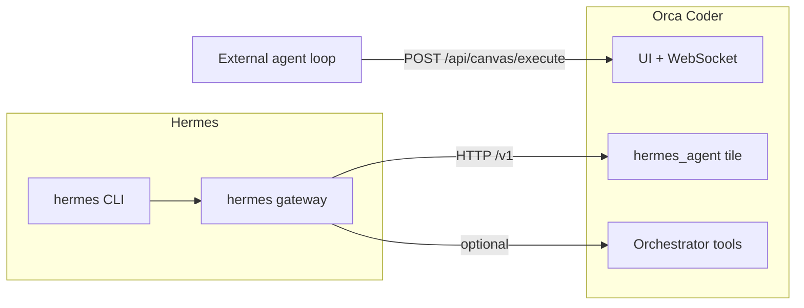

# Hermes + Orca Coder — visual setup guide

This guide ties together **NousResearch Hermes**, the **Orca desktop app**, the **canvas bridge**, and optional **in-app Hermes tiles**. Use it when onboarding a teammate or debugging “gateway unreachable” / “command not found” issues.

**Quick open:** [HTML slide deck](slides/hermes-orca-setup.html) (open in a browser — keyboard arrows to navigate).

---

## 1. Pick your integration shape

You can mix these, but most people start with one primary path.

| Path | Best for | Orca must |
|------|-----------|-----------|
| **A — Canvas bridge only** | Hermes (or Pi, OpenClaw) drives tools; Orca is the effector | Dev server + **Orca UI window open** (`uiClients ≥ 1`) |
| **B — In-app Hermes tile + gateway** | Chat in a `hermes_agent` tile, Responses API | Hermes **CLI** on PATH + `hermes gateway` (or remote API URL) |
| **C — Skills in Hermes from this repo** | Hermes loads Orca bridge skills | Run `npm run hermes:install-skills` from Orca repo root |



---

## 2. Prerequisites (checklist)

- [ ] **Orca Coder** cloned; `npm install` at repo root if you develop the app.
- [ ] **Desktop app** for local CLI detection and Tauri features (Hermes key from `~/.hermes/.env` is read in the desktop build).
- [ ] **Hermes** from [github.com/NousResearch/hermes-agent](https://github.com/NousResearch/hermes-agent) — install so `hermes --version` works in a **normal terminal** (same PATH the app inherits).
- [ ] For the **bridge**: `packages/server` on port **3001** (default) with Orca UI connected — see [CANVAS_AGENT_BRIDGE.md](CANVAS_AGENT_BRIDGE.md).

---

## 3. Tutorial A — Bridge (external agent drives Orca)

**Goal:** Your agent’s tool loop calls Orca’s HTTP API; the UI shows tiles and file changes.

1. Start the stack: from repo root, `npm run dev` (or your usual dev command that starts the client **and** the Node server on `:3001`).
2. **Open Orca** and load a workspace folder (sidebar).
3. Verify readiness:

   ```bash
   curl -s http://127.0.0.1:3001/api/canvas/bridge-status
   ```

   Expect `uiClients` at least **1** while the app window is open.

4. Fetch tool definitions:

   ```bash
   curl -s http://127.0.0.1:3001/api/canvas/tools | head -c 500
   ```

5. Execute a tool (example):

   ```bash
   curl -s -X POST http://127.0.0.1:3001/api/canvas/execute \
     -H 'Content-Type: application/json' \
     -d '{"tool":"canvas_list_modules","arguments":{}}'
   ```

6. If you set `CANVAS_BRIDGE_TOKEN` on the server, add `Authorization: Bearer <token>` to every `execute` (and related) calls.

**Tip:** Hermes should send `X-Orca-External-Agent: hermes` on tool executes if you want Orca’s **Hermes mode** auto-lock in Settings.

**Example — closing the loop from a shell:** after work finishes outside the main loop, use `orca reply "…"` or `POST /api/orchestrator/reply` so the lead orchestrator sees a handoff. Details: [CANVAS_AGENT_BRIDGE.md](CANVAS_AGENT_BRIDGE.md) (Orchestrator reply section).

---

## 4. Tutorial B — In-app Hermes tile and gateway

**Goal:** Use the **Hermes agent** module on the canvas talking to `POST /v1/responses` (or your configured base).

1. Install Hermes CLI; confirm:

   ```bash
   hermes --version
   ```

2. Start the API server (typical local dev):

   ```bash
   API_SERVER_ENABLED=true hermes gateway
   ```

   Default base is often `http://127.0.0.1:8642/v1` — match **Settings → Integrations → Hermes API** (base URL + optional model).

3. In Orca: **Settings → Agent → Hermes** — enable **Show Hermes agent tile in add-tile menus** if you want `hermes_agent` tiles and orchestrator tools like `chat_with_hermes_tile`.

4. Add a **Hermes agent** tile from the tile menu; use **Start gateway** in the tile if Orca can spawn a terminal (local gateway only).

**Tip:** Orca can auto-read `API_SERVER_KEY` from `~/.hermes/.env` when the Integrations key field is empty — prefer `configure_hermes_api` with `api_key: ""` to clear a stale UI key rather than inventing secrets.

---

## 5. Install skills into Hermes (from this repo)

From the **Orca repository root**:

```bash
npm run hermes:install-skills
```

Optional:

```bash
HERMES_SKILLS_DIR=/path/to/hermes/skills node scripts/install-hermes-skills.mjs
```

Smoke test:

```bash
npm run orca:bridge -- status
```

Expect healthy bridge status with the UI open. See [docs/skills/hermes/README.md](skills/hermes/README.md) for paths.

---

## 6. Troubleshooting (symptoms → actions)

| Symptom | Likely cause | What to do |
|--------|----------------|------------|
| `hermes: command not found` | CLI not on PATH | Install Hermes; reopen terminal; confirm `hermes --version`. |
| Connection refused / cannot reach Hermes | Gateway not running | Run `API_SERVER_ENABLED=true hermes gateway`; check base URL in Integrations. |
| 401 / 403 from API | Bearer mismatch | Align `API_SERVER_KEY` in `~/.hermes/.env` with Orca Integrations or clear UI key. |
| Bridge `uiClients: 0` | No UI connected | Keep Orca window open; check correct port and token. |
| Orchestrator offers Hermes tools but you do not use Hermes | Setting on | **Settings → Agent → Hermes** — turn off **Show Hermes agent tile** to hide Hermes-only tools. |

### In-app helper (desktop)

With **Show Hermes agent tile** enabled, open **Settings → Agent → Hermes** and use **Run diagnose** (checks `hermes --version` and optional `GET /models`).

### Orchestrator tool

The built-in tool **`diagnose_hermes_setup`** returns markdown with the same checks: CLI presence, gateway reachability, and whether to install Hermes or disable the Hermes tile.

---

## 7. Examples (copy-paste)

**Probe bridge (no auth):**

```bash
curl -s http://127.0.0.1:3001/api/canvas/bridge-status | jq .
```

**Read a file via bridge:**

```json
{
  "tool": "read_file",
  "arguments": { "path": "README.md" }
}
```

Post with `curl -X POST .../api/canvas/execute -d @body.json`.

**Hermes external header (for auto-detection):**

```http
X-Orca-External-Agent: hermes
```

---

## 8. Where to read next

| Doc | Topic |
|-----|--------|
| [AGENT_ORCHESTRATOR_SYNC.md](AGENT_ORCHESTRATOR_SYNC.md) | Keywords, skill entry, verification curls |
| [CANVAS_AGENT_BRIDGE.md](CANVAS_AGENT_BRIDGE.md) | Full HTTP contract, auth, group chat, Option B |
| [skills/hermes/README.md](skills/hermes/README.md) | Skill install paths, smoke test |
| [skills/hermes-orca-bridge/SKILL.md](skills/hermes-orca-bridge/SKILL.md) | Hermes-specific bridge skill |
| [skills/orca-external-orchestrator/SKILL.md](skills/orca-external-orchestrator/SKILL.md) | Any external orchestrator |

---

## 9. Slide deck (visuals)

Open in a browser (file or served):

- **`docs/slides/hermes-orca-setup.html`**

Use **Left/Right arrow** keys (or on-screen controls) to move between slides. Good for walkthroughs and screen sharing.
